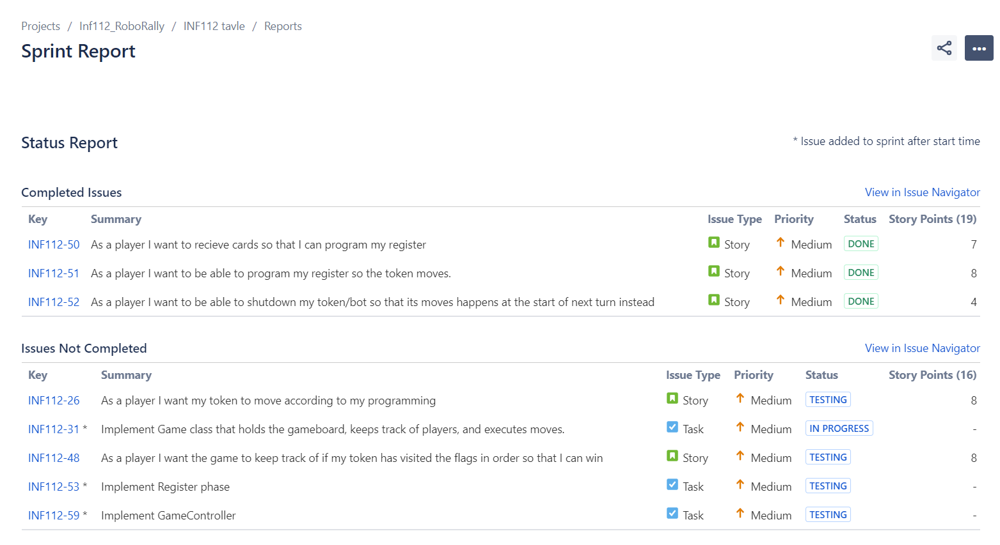
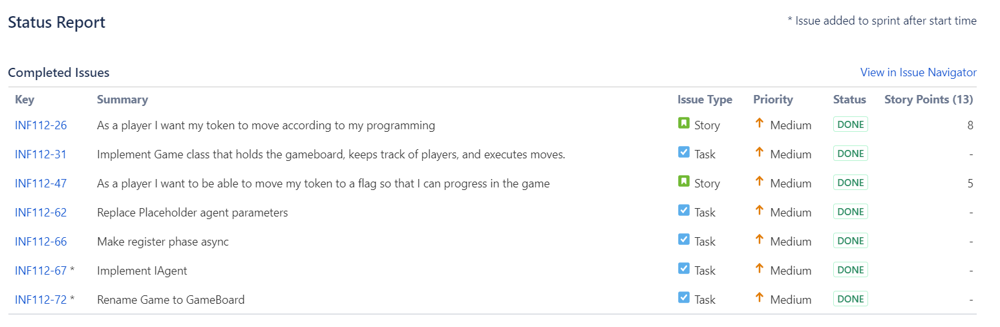
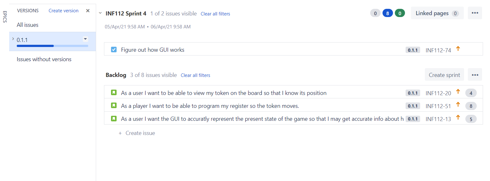
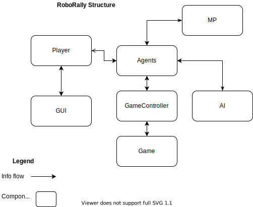

# Obligatorisk 1.

## Hva har blitt gjort
Fokuset siden forgje oblig har vært på å få all spill logikken på plass.
Så langt er 80% av backend ferdig. Det eneste som mangler er noen tiles typer, logikken for disse, og 
logikk for å signalisere at noen har vunnet spillet.

Alt arbeidet har blitt gjort over 3-4 sprints. Dessverer har jeg bare raportene til de første to

###### Første Sprint

###### Andre sprint

## Ting som ikke har gått så bra
Jeg hadde håpet at jeg ville fått implementert en enkel GUI,
men dette fikk jeg ikke tid til. Jeg planla også å få ferdig alle tile typene, men dette skjedde heller ikke.

###### Backlog

## Hva har gått bra
Jeg fikk kommet lengre enn planlagt på backend delen av spillet. 
Jeg er sikker på at det designet jeg har fungerer bra og er robust.
Bruken av interfacet IAgent for å representere en spiller gjør at spillet selv
ikke bryr seg om det er en virkelig spiller, AI, multiplayer conection, osv som betyr at
den ikke trenger noe spesiell logikk for dette. Så lenge det implementerer IAgent så kan de spille.

###### Program struktur (WiP)

## Planen framover
Hovedprioriteten nå kommer til å være å få på plass noen enkle IAgent typer, feks. en debug GUI, eksempel AI, etc.

## Issue siden
* ##### [Issues](https://sanderwiig.atlassian.net/jira/software/c/projects/INF112/issues/)
